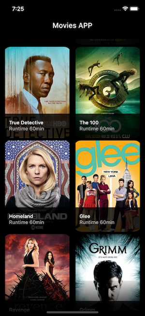

# Flutter Movie App

A simple app displaying shows using the TV Maze API.
 

## 📸 ScreenShots

| Home | Single Movie |
|------|-------|
|||

## 🔌 Plugins
| Name | Usage |
|------|-------|
|[**GetX**](https://pub.dev/packages/get)| State And Route Management|

## 🤓 Author(s)
**Chisom Ekwuribe** 

<!-- 
## 🔖 LICENCE
[Apache-2.0](https://github.com/JideGuru/FlutterEbookApp/blob/master/LICENSE) -->